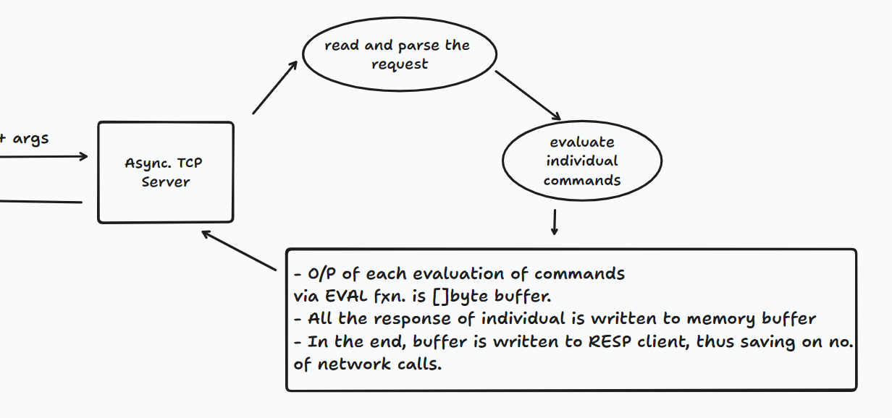

# Command Pipelining (ce1690d492e4ab0d8ad0ee1ada6d666ef24eb3d1)

### Abstract 
Execution of multiple commands at a same time, without waiting for response.

#### Advantages: 
1. Network cost saved.
2. Do not have to wait for response of 1 command to be returned for making new request.

### Current State of Application


### Expected State of application


Each eval function returns []byte buffer and after evaluation, the reply response of individual commands is stored in the memory buffer itself. After completion of all the commands, data is being written back to the client.

```golang

func EvalAndRespond(cmds []*RedisCmd, conn io.ReadWriter)  {
	
	var response []byte
	buf := bytes.NewBuffer(response)
// write all the responses to the in-memory buffer
	for _, cmd:= range cmds {
		switch cmd.Cmd {
		case "PING":
			 evalPING(cmd.Args)
		case "SET":
			 buf.Write(evalSET(cmd.Args))
		case "GET":
			 buf.Write(evalGET(cmd.Args))
		case "TTL":
			buf.Write(evalTTL(cmd.Args))
		case "DEL":
			 buf.Write(evalDEL(cmd.Args))
		case "EXPIRE":
			buf.Write(evalEXPIRE(cmd.Args))
		default:
			buf.Write(evalPING(cmd.Args))
		}
	}

	// collectively send output
	conn.Write(buf.Bytes())
}

```


